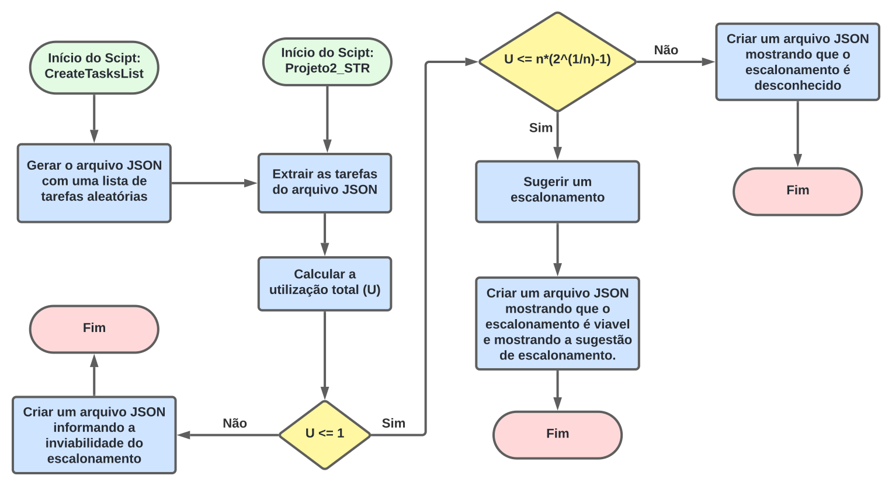

# Projeto 2 - Sistemas em Tempo Real

---

## Descrição Geral

    O projeto consiste em um programa na linguguagem Python para determinar se o escalonamento
    de uma carga de trabalho específica é viável usando o algoritmo Rate Monotonic (RM). Caso seja,
    sugerir um escalonamento possível para a carga de trabalho utilizando uma heurística baseada
    na análise das tarefas fornecidas.

### Bibliotecas
    random
    json

### Arquivo 1

Tem como objetivo gerar a lista de tarefas de forma aleatória em um arquivo .json, onde cada tarefa deve
possuir os seguintes atributos: 
    
    - id: identificador único da tarefa (string).
    - period: período da tarefa em milissegundos (inteiro).
    - execution_time: tempo de execução da tarefa em milissegundos (inteiro).

### Arquivo 2

A partir do arquivo gerado anteriormente, tem como objetivo verificar a viabilidade do escalonamento
através da fórmula de utilização total (U).

Assim, existem três resultados possíveis:

    - Viável: se U for menor que o limite calculado.
    - Desconhecido: se U for maior que o limite calculado e menor que 1.
    - Não viável: se U for maior que 1.

Ao final, a saída do projeto será um arquivo em formato .json contendo as seguintes informações:

    - Viabilidade do escalonamento: uma mensagem indicando se o escalonamento é viável ou não, com base
    na análise da carga de trabalho fornecida.
    - Sugestão de escalonamento: uma sugestão de escalonamento para as tarefas, usando uma heurística
    apropriada, listando as tarefas em ordem de prioridade.
## Fluxograma do algoritmo

## Demonstração

Link de acesso ao vídeo no YouTube: https://youtu.be/XLX-k2XmsSQ

## Desenvolvedores

    Matheus Lucas   (matheuslucas.farias@ee.ufcg.edu.br)
    Tâmara Ruth     (tamara.santos@ee.ufcg.edu.br)
    Tulio Tavares   (tulio.tavares@ee.ufcg.edu.br)
